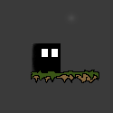

# Games

### Ludum Dare Entries

The Ludum Dare is a 48 & 72 Hour game development competition where you set out to write a game from scratch.

- [Ludum Dare Old site](http://ludumdare.com/)
- [Ludum Dare New site](https://ldjam.com/)

---

[LD38: The Grass is Always Greener](https://github.com/intxparts/TheGrassIsAlwaysGreener)

- Theme: A Small World
- Very short, 2D platformer, event driven story
- [Latest Release](https://github.com/intxparts/TheGrassIsAlwaysGreener/releases/download/0.0.1/TheGrassIsAlwaysGreener.zip)

---

[LD36: The Collector](https://github.com/intxparts/ludumDare36)

- Theme: Ancient Technology
- 2D top down, dungeon crawler, player v. environment, collect the artifacts
- [Latest Release](https://github.com/intxparts/ludumDare36/releases/download/1.1.1/game-1.1.1.zip)

---

[LD34: Wayward Souls](https://github.com/intxparts/wayward_souls)

- Theme: Growth
- 2D platformer, event driven story
- [Latest Release](https://github.com/intxparts/wayward_souls/releases/download/v1.0.0/wayward_souls.zip)

