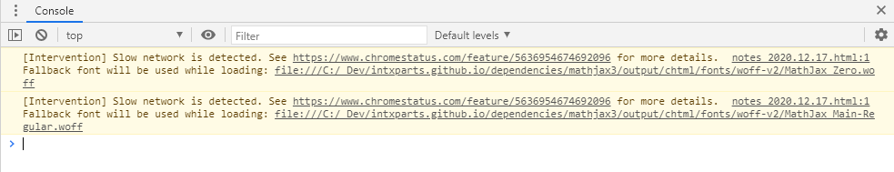

<link rel="stylesheet" href="..\dependencies\katex0.12.0\katex.min.css">
<script defer src="..\dependencies\katex0.12.0\katex.min.js"></script>
<script defer src="..\dependencies\katex0.12.0\contrib\auto-render.min.js" onload="renderMathInElement(document.body);"></script>
# Rendering math equations

*2020.12.17*

There are many ways to render math related content in a website. Here are some of the few ways I discovered:

- use a tool (ex: [Pandoc](https://pandoc.org/)) to convert from a math format (LaTeX) to HTML
- convert math content to images and use the images in the HTML
- use a javascript client-side library to render the content on the fly
- pre-render the HTML on the server side

There are several javascript libraries that support these features:

- [MathJax](https://www.mathjax.org/)
- [KaTeX](https://katex.org/)

This site is made using Pandoc to convert markdown files to HTML to keep things as simple as possible. No javascript, pure HTML, very lightweight. Pandoc has support for converting embedded LaTeX in markdown files to HTML. There are several supported libraries for this conversion process: jsMath, MathJax, etc. Unfortunately these solutions do not work when using the **-s | --standalone** option with Pandoc. 

Thankfully, markdown supports embedding HTML directly in **\*.md** files. I first tried MathJax but there were some quirks. MathJax appears to always try to load web fonts even when the fonts are served causing some slower load times. 



While digging into this issue, I stumbled across KaTeX as a recommended solution that is supposed to be much faster rendering wise. Desiring simplicity and better performance, I decided to look into KaTeX. Embedding the following in the markdown works effectively with my current solution using Pandoc: markdown -> html.

```html
<link rel="stylesheet" href="..\dependencies\katex0.12.0\katex.min.css">
<script defer src="..\dependencies\katex0.12.0\katex.min.js"></script>
<script defer src="..\dependencies\katex0.12.0\contrib\auto-render.min.js" onload="renderMathInElement(document.body);"></script>
```

The next step is to avoid this altogether and build a tool to generate the desired HTML from the Pandoc output so that the visitors of the website will not be required to download and run any javascript. This solution needs to be investigated to see if the performance of the site would be better. There are notes from others that have done this that there is a trade off if there are a lot of equations embedded in the site, that the ssr would produce much larger HTML files.

$$\int u dv = uv - \int v du$$

